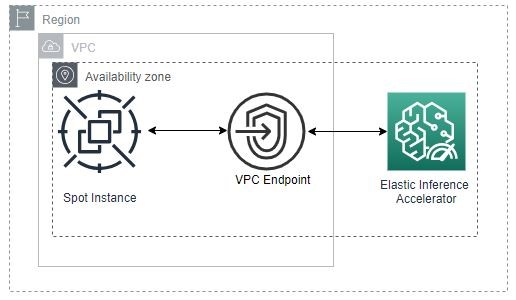

# Running Amazon Elastic Inference on Amazon EC2 Spot Instances

## Overview
This workshop is designed to get you familiar with the concepts and best practices for requesting Amazon EC2 instances with Elastic Inference.

## Requirements, notes, and legal
1.	To complete this workshop, have access to an AWS account with administrative permissions. An IAM user with administrator access **(arn:aws:iam::aws:policy/AdministratorAccess)** will do nicely.
2.	**This workshop is self-paced.** The instructions will primarily be given using the AWS Command Line Interface (CLI) - this way the guide will not become outdated as changes or updates are made to the AWS Management Console. However, most steps in the workshop can be done in the AWS Management Console directly. Feel free to use whatever is comfortable for you.
3.	While the workshop provides step-by-step instructions, please do take a moment to look around and understand what is happening at each step. The workshop is meant as a getting started guide, but you will learn the most by digesting each of the steps and thinking about how they would apply in your own environment. You might even consider experimenting with the steps to challenge yourself.
4.	This workshop has been designed to run in any public AWS Region that supports Elastic Inference. See Regional Products and Services for details.
5.	During this workshop, you will install software (and dependencies) on the Amazon EC2 instances launched in your account. The software packages and/or sources you will install will be from the Amazon Linux 2 distribution as well as from third party repositories and sites. Please review and decide your comfort with installing these before continuing.

## Architecture
In this workshop, you will deploy the following:

An AWS CloudFormation stack, which will include:
1. An Amazon Virtual Private Cloud (Amazon VPC) 
2. VPC Endpoint for Elastic Inference accelerator
3. Elastic Inference accelerator
4. Supporting IAM policies and roles
5. Supporting security groups
6. An Amazon EC2 Launch Template
7. An Amazon EC2 fleet to deploy EC2 Spot instance(s)

Here is a diagram of the resulting architecture:

**Let's Begin**

